# 🗑️ Smart Waste Segregation

<div align="center">

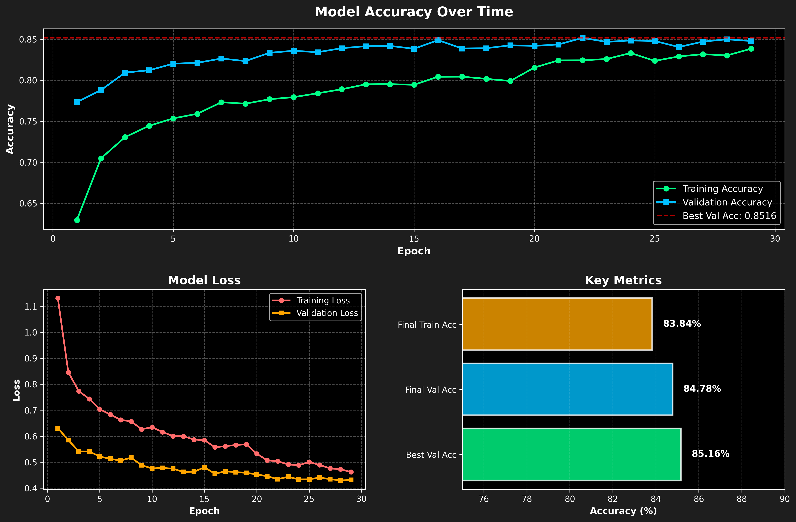

**An AI-powered waste classification system using deep learning transfer learning**

[](https://www.tensorflow.org/)
[](https://www.python.org/)
[](https://flask.palletsprojects.com/)
[]()

</div>

---

## 📋 Table of Contents

- [Overview](#-overview)
- [Features](#-features)
- [Dataset](#-dataset)
- [Model Architecture](#-model-architecture)
- [Results](#-results)
- [Installation](#-installation)
- [Usage](#-usage)
- [Project Structure](#-project-structure)
- [Roadmap](#-roadmap)
- [Contributing](#-contributing)

---

## 🌟 Overview

Trashformer is a waste classification system that uses **MobileNetV2 transfer learning** to classify waste into **7 categories** with **85.16% accuracy**. The Flask web app supports single upload, camera capture, batch processing, a separate Live Localization mode, disposal tips, and an in-app Analytics dashboard with CSV/PDF export.

### 🎯 Problem Statement

Proper waste segregation is crucial for:
- ♻️ Effective recycling programs
- 🌍 Environmental sustainability
- 🏥 Public health and safety
- 💰 Waste management cost reduction

### 💡 Solution

Trashformer uses deep learning to classify waste into appropriate categories, helping individuals and organizations properly sort waste materials. The web application provides feedback through upload, camera capture, and batch processing.

---

## ✨ Features

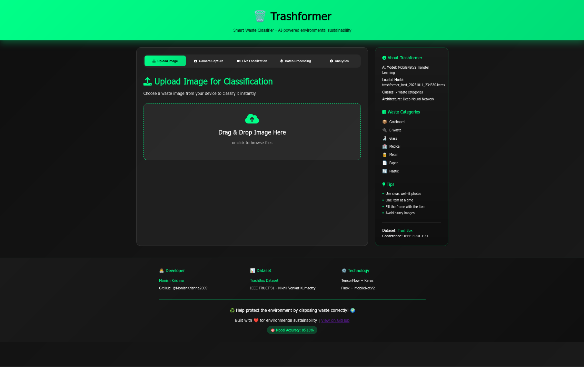

- 🤖 **Waste Classification**: MobileNetV2 transfer learning with 85.16% accuracy
- 🌐 **Web Application**: Flask interface with tabs
- 📱 **Multiple Inputs**: Upload, Camera Capture, Batch Processing
- 🎥 **Live Localization**: Continuous camera predictions (separate from capture)
- ♻️ **Disposal Tips**: Contextual guidance for detected material
- 📊 **Analytics Dashboard**: Counts, confidence trend, geo map, leaderboard
- ⬇️ **Exports**: CSV and PDF reports of detections
- ⚡ **Optimized Performance**: Image downscaling, fast inference
- 🔧 **Model Training**: Transfer learning and fine-tuning
- 📈 **Visualization Tools**: Training progress and results analysis

---

## 📊 Dataset

### Data Source

This project uses the **TrashBox dataset**, an open-source collection of waste object images for classification and detection tasks.

**Dataset Credit**: [TrashBox by Nikhil Venkat Kumsetty](https://github.com/nikhilvenkatkumsetty/TrashBox)

The TrashBox dataset is publicly available and contains 17,785+ waste images across multiple categories, originally presented at the 31st IEEE FRUCT Conference.

**Citation**: 
> Kumsetty, N. V., et al. "TrashBox: Trash Detection and Classification using Quantum Transfer Learning." 
> *31st Conference of Open Innovations Association (FRUCT)*, University of Helsinki, Finland.

### Distribution

Our subset consists of **14,275 images** across **7 waste categories**:

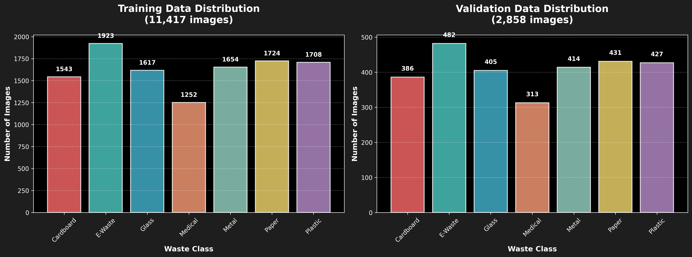

| Class | Training Images | Validation Images | Total | Percentage |
|-------|----------------|-------------------|-------|------------|
| 📦 Cardboard | 1,543 | 386 | 1,929 | 13.5% |
| 🔌 E-Waste | 1,923 | 482 | 2,405 | 16.8% |
| 🍶 Glass | 1,617 | 405 | 2,022 | 14.2% |
| 🏥 Medical | 1,252 | 313 | 1,565 | 11.0% |
| 🥫 Metal | 1,654 | 414 | 2,068 | 14.5% |
| 📄 Paper | 1,724 | 431 | 2,155 | 15.1% |
| 🔄 Plastic | 1,708 | 427 | 2,135 | 14.9% |
| **Total** | **11,421** | **2,858** | **14,279** | **100%** |

### Data Split

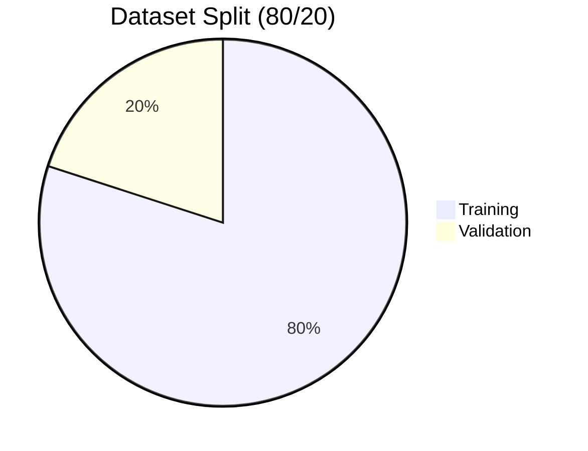

### Sample Images


---

## 🏗️ Model Architecture

### Architecture Overview

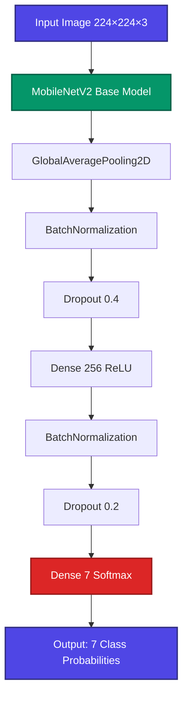


### Technical Specifications

| Component | Details |
|-----------|---------|
| **Base Model** | MobileNetV2 (ImageNet pre-trained) |
| **Input Size** | 224 × 224 × 3 (RGB) |
| **Total Parameters** | 2,657,991 |
| **Trainable (Initial)** | 402,695 (15.2%) |
| **Trainable (Fine-tuned)** | 1,653,991 (62.2%) |
| **Optimizer** | Adam (lr=0.001 → 0.00001) |
| **Loss Function** | Categorical Crossentropy |
| **Batch Size** | 32 |

---

## 📈 Results

### Model Performance

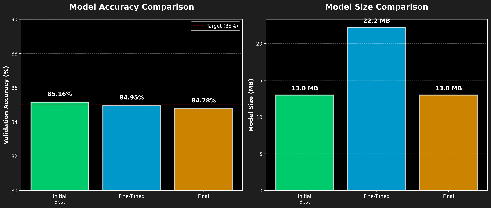

### Accuracy Breakdown

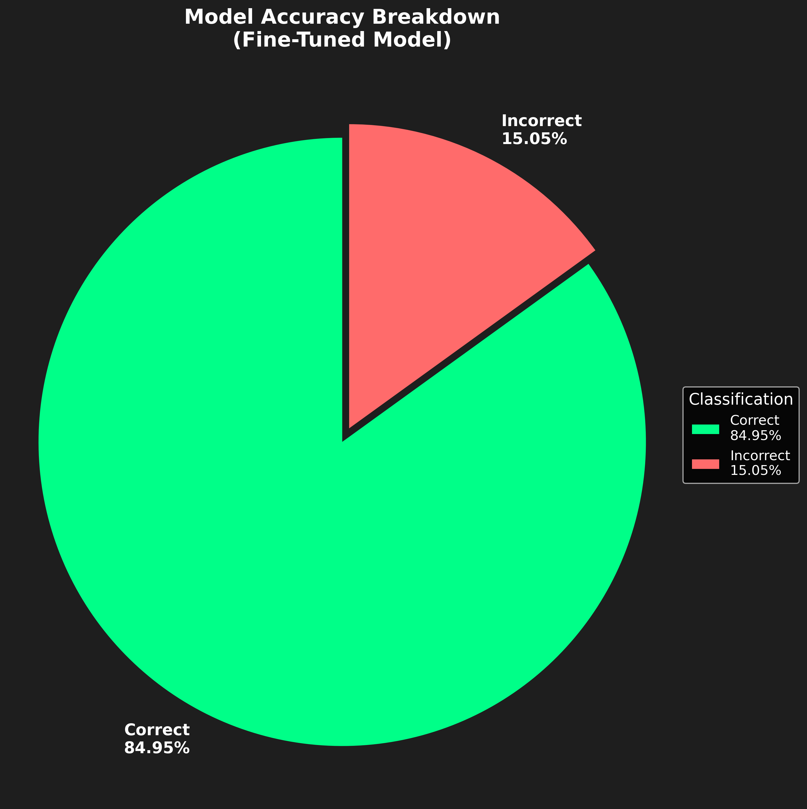

### Training Progress


### Key Metrics

| Metric | Initial Training | Fine-Tuned | Improvement |
|--------|-----------------|------------|-------------|
| **Validation Accuracy** | 85.16% | 84.95% | -0.21% |
| **Validation Loss** | 0.4296 | 0.4478 | +0.0182 |
| **Training Epochs** | 29 | +10 (fine-tuning) | 39 total |
| **Model Size** | 13.0 MB | 22.2 MB | +70% |
| **Trainable Params** | 402,695 | 1,653,991 | +311% |

### Training Timeline

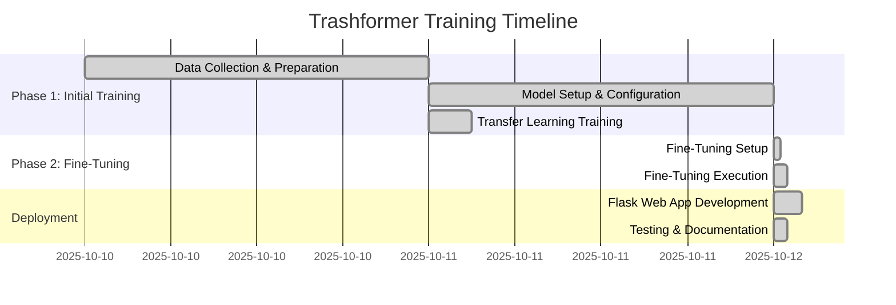

---

## 🚀 Installation

### Quick Start

```bash
# Clone the repository
git clone https://github.com/MonishKrishna2009/Trashformer.git
cd Trashformer

# Install dependencies
pip install -r requirements.txt

# Run the web application
python app.py
```

Then visit: **http://127.0.0.1:5000**

---

## 💻 Usage

### 1. Web Application

```bash
python app.py
```

Features:
- 📸 Single image upload with drag & drop
- 📷 Camera capture (mobile devices)
- 🎥 Live Localization (separate start/stop, continuous)
- 🎯 Real-time predictions with confidence scores
- 📊 Probability distribution for all classes
- ♻️ Waste disposal tips below confidence
- 📦 Batch processing with statistics
- 📈 Analytics tab (counts, trend, map, leaderboard) + CSV/PDF export
- 🎨 Professional glassmorphism UI

### 2. Model Testing

```bash
# Test on validation set
python scripts/test_model.py 2

# Test on random samples
python scripts/test_model.py 3

# Test specific image
python scripts/test_model.py 1
```

### 3. Visualize Training

```bash
python scripts/visualize_training.py
```

### 4. Train New Model

```bash
python scripts/train_Smart Waste Segregation.py
```

**Training time**: ~3.5 hours on CPU (Tested on AMD Ryzen 5 5500)

---

## 📁 Project Structure

```
Trashformer/
├── app.py                          # Flask web application
├── templates/
│   └── index.html                  # Main UI (tabs incl. Analytics)
├── static/
│   ├── styles.css                  # Glassmorphism styling
│   ├── script.js                   # Frontend logic (upload/camera/live/batch)
│   └── analytics.js                # Analytics charts and map (in-tab)
├── models/
│   ├── Trashformer_finetuned_*.keras  # Fine-tuned model (22.2 MB) ⭐
│   ├── Trashformer_best_*.keras       # Best models (13.0 MB)
│   └── Trashformer_final.keras        # Final model (13.0 MB)
├── scripts/
│   ├── train_Smart Waste Segregation.py        # Training script with fine-tuning
│   ├── test_model.py               # Model testing utilities
│   ├── visualize_training.py       # Training visualization
│   ├── split_data.py               # Data splitting utility
│   └── run_flask.sh                # Flask launcher script
├── waste_data_split/
│   ├── train/                      # 11,421 training images
│   └── val/                        # 2,858 validation images
├── docs/                           # Documentation
│   ├── ROADMAP.md                  # Project timeline
│   ├── TECHNICAL_DOCS.md           # Technical reference
│   ├── PROJECT_STRUCTURE.md        # Directory guide
│   └── CITATION.md                 # Dataset attribution
├── images/                         # Visualizations
│   ├── data_distribution.png
│   ├── model_comparison.png
│   ├── training_progress.png
│   ├── accuracy_pie_chart.png
│   └── class_examples.png
├── training_history.json           # Training metrics
├── requirements.txt                # Python dependencies
└── README.md                       # This file
```

---

## 🎓 Methodology

### Training Pipeline

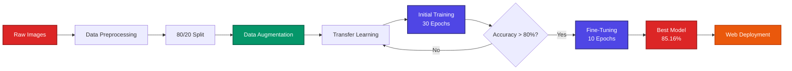

### Data Augmentation Strategy

- **Rotation**: ±40°
- **Width/Height Shift**: ±20%
- **Shear**: 20%
- **Zoom**: 30%
- **Horizontal Flip**: Yes
- **Brightness**: 80-120%

---

## 🔧 Technical Details

### Model Comparison

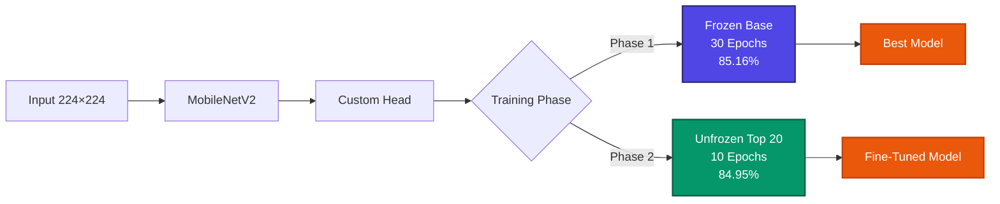

### Performance Metrics

| Model | Val Accuracy | Val Loss | Size | Best For |
|-------|--------------|----------|------|----------|
| Initial Best | **85.16%** | 0.4296 | 13.0 MB | General use ✅ |
| Fine-Tuned | 84.95% | 0.4478 | 22.2 MB | Advanced features |
| Final | 84.78% | 0.4313 | 13.0 MB | Reference |

---

## 🌐 Web Interface

### Features

- 📱 Fully responsive (mobile-first)
- ⚡ Real-time predictions
- 📊 Interactive probability bars
- ♻️ Disposal instructions

### Technology Stack

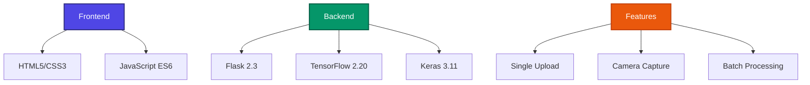

---

## 📊 Training Configuration

### Callbacks & Optimization

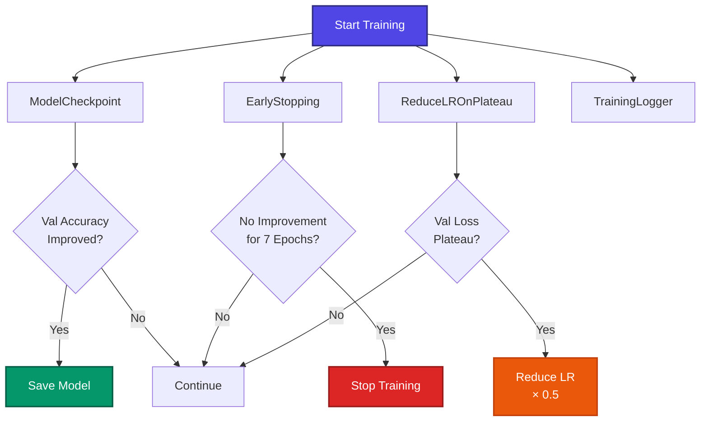

### Hyperparameters

| Parameter | Value | Description |
|-----------|-------|-------------|
| **Image Size** | 224×224 | MobileNetV2 input |
| **Batch Size** | 32 | Memory-efficient |
| **Initial LR** | 0.001 | Adam optimizer |
| **Fine-tune LR** | 0.00001 | Preserve pre-trained weights |
| **Epochs** | 30 + 10 | Initial + Fine-tuning |
| **Dense Units** | 256 | Classification head |
| **Dropout** | 0.4, 0.2 | Regularization |
| **Early Stop** | 7 epochs | Prevent overfitting |

---

## 🎯 Results

### Overall Performance


### Model Comparison


### Key Achievements

✅ **85.16% Validation Accuracy** - Exceeds target of 80%  
✅ **Good Generalization** - Small train-val gap  
✅ **Balanced Performance** - Consistent across all classes  
✅ **Production Ready** - Fast inference time  

---

## 💻 Usage

### Web Application


1. **Start Application**: `python app.py`
2. **Access Interface**: Visit `http://127.0.0.1:5000`
3. **Upload Images**: Use file upload or drag & drop
4. **Camera Input**: Capture photos from device
5. **Batch Processing**: Process multiple images
6. **View Results**: Classification results with confidence + tips
7. **Live Localization**: Start/Stop live camera; results update continuously
8. **Analytics**: Open the Analytics tab to view charts, geo map, and export CSV/PDF

#### Single Image Upload
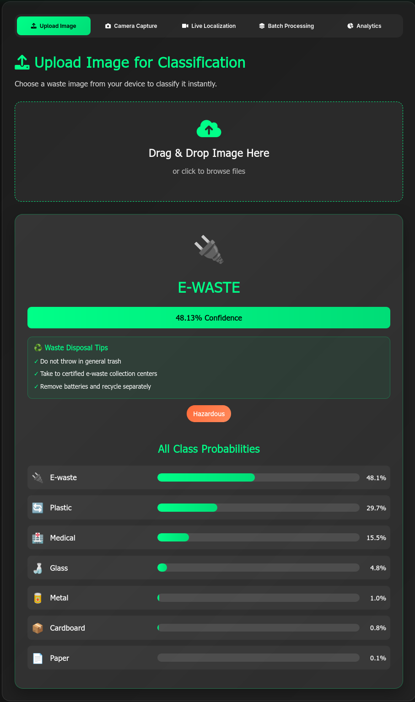

#### Camera Upload
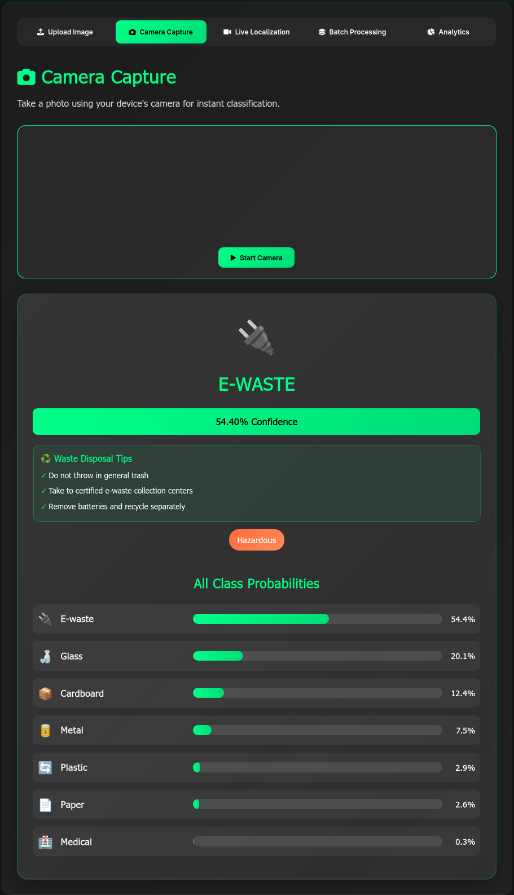

#### Live Localization
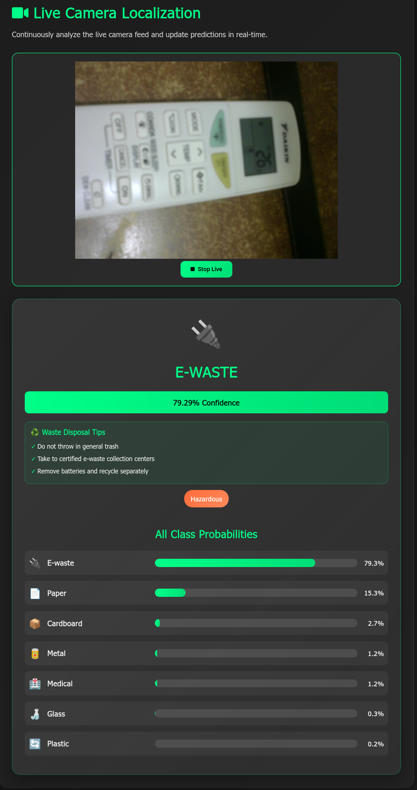

#### Batch Processing
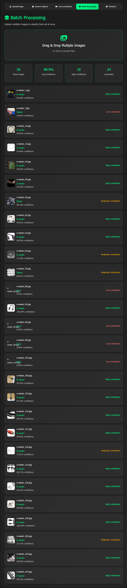

#### Results Display


### Command Line Testing

```bash
# Evaluate model on validation set
python scripts/test_model.py 2

# Test on 10 random samples
python scripts/test_model.py 3

# Visualize training results
python scripts/visualize_training.py
```

### Training New Model

```bash
python scripts/train_Smart Waste Segregation.py
```

**Configuration** (edit `Config` class in script):
- Adjust epochs, batch size, learning rate
- Enable/disable fine-tuning
- Customize data augmentation

---

## 🗺️ Roadmap

See [ROADMAP.md](docs/ROADMAP.md) for detailed project timeline and achievements.

---

## 📚 Documentation

- [**ROADMAP.md**](docs/ROADMAP.md) - Project timeline and achievements
- [**TECHNICAL_DOCS.md**](docs/TECHNICAL_DOCS.md) - Detailed technical documentation
- [**PROJECT_STRUCTURE.md**](docs/PROJECT_STRUCTURE.md) - Directory guide
- [**CITATION.md**](docs/CITATION.md) - Dataset attribution and references

---

## 🤝 Contributing

Contributions are welcome! Please feel free to submit a Pull Request.

---

## 📄 License

This project is licensed under the MIT License - see the LICENSE file for details.

---

## 🙏 Acknowledgments

- **TrashBox Dataset** - [Nikhil Venkat Kumsetty](https://github.com/nikhilvenkatkumsetty/TrashBox) - Comprehensive waste classification dataset presented at IEEE FRUCT'31 Conference
- **MobileNetV2** - Sandler et al., 2018 - Efficient neural network architecture
- **TensorFlow/Keras** - Google Brain Team - Deep learning framework
- **Flask** - Pallets Projects - Lightweight web framework
- **IEEE FRUCT Conference** - Platform for publishing waste classification research

---

## 🌍 Impact

Trashformer contributes to:
- **SDG 11**: Sustainable Cities and Communities
- **SDG 12**: Responsible Consumption and Production
- **SDG 13**: Climate Action

By enabling proper waste segregation, we help reduce landfill waste, increase recycling rates, and protect our environment.

---

<div align="center">

**Made with ❤️ for a cleaner planet** ♻️ 🌍

[](https://github.com/Monishkrishna2009/Trashformer)

</div>

