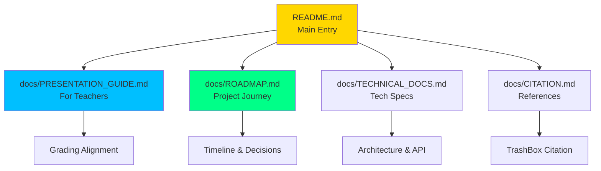

# 📁 Trashformer - Project Structure

## Clean & Organized Directory Layout

```
Trashformer/
│
├── 📄 README.md                      # Main documentation ⭐ START HERE
├── 📄 LICENSE                        # MIT License
├── 📄 requirements.txt               # Python dependencies
├── 📄 .gitignore                     # Git ignore rules
│
├── 🌐 app.py                         # Flask web application (MAIN ENTRY)
│
├── 📂 templates/                     # HTML templates
│   └── index.html                    # Main web interface (tabs incl. Analytics)
│
├── 📂 static/                        # Static assets (CSS, JS, Images)
│   ├── styles.css                    # Dark theme styling
│   ├── script.js                     # App logic (upload/camera/live/batch)
│   ├── analytics.js                  # Analytics charts and map
│   ├── favicon.ico                   # Website favicon (ICO format)
│   └── favicon.svg                   # Website favicon (SVG format)
│
├── 📂 models/                        # Trained AI models
│   ├── trashformer_finetuned_*.keras # Fine-tuned model (22.2 MB) ⭐ BEST
│   ├── trashformer_best_*.keras      # Best models (13.0 MB)
│   └── trashformer_final.keras       # Final model (13.0 MB)
│
├── 📂 scripts/                       # Training & utility scripts
│   ├── train_trashformer.py          # Main training script
│   ├── test_model.py                 # Model testing & validation
│   ├── visualize_training.py         # Training visualization
│   ├── split_data.py                 # Data splitting utility
│   ├── test_setup.py                 # Setup verification
│   └── run_flask.sh                  # Flask app launcher
│
├── 📂 docs/                          # Documentation
│   ├── ROADMAP.md                    # Project journey & timeline ⭐
│   ├── TECHNICAL_DOCS.md             # Technical specifications
│   ├── PROJECT_STRUCTURE.md          # This file
│   └── CITATION.md                   # Dataset attribution
│
├── 📂 images/                        # Visual assets
│   ├── data_distribution.png         # Dataset breakdown
│   ├── model_comparison.png          # Model metrics
│   ├── training_progress.png         # Training curves
│   ├── accuracy_pie_chart.png        # Accuracy visualization
│   ├── class_examples.png            # Sample images
│   └── 📂 website/                   # Web application screenshots
│       ├── Website1.png              # Main application overview
│       ├── SingleUpload.png          # Single upload feature
│       ├── CameraUpload.png          # Camera upload feature
│       ├── LiveLocalization.png      # Live localization feature
│       ├── BatchProcessing.png       # Batch processing feature
│       └── Accuracy.png              # Results display (legacy)
│
├── 📊 training_history.json          # Training metrics (JSON)
│
└── 📂 waste_data_split/              # Dataset (NOT in repo - too large)
    ├── train/                        # Training images (11,421)
    └── val/                          # Validation images (2,858)
```

---

## 📊 Directory Purpose

| Directory | Purpose | Files |
|-----------|---------|-------|
| **/** (root) | Core application files | 5 |
| **templates/** | HTML templates | 1 |
| **static/** | CSS/JS assets | 1 |
| **models/** | Trained models | 4 |
| **scripts/** | Training & testing scripts | 6 |
| **docs/** | Documentation | 5 |
| **images/** | Visualizations | 5 |

---

## 🔑 Key Files

### Essential Files (Must Review)

| File | Description | Priority |
|------|-------------|----------|
| `README.md` | Main documentation with Mermaid diagrams | ⭐⭐⭐⭐⭐ |
| `app.py` | Flask web application | ⭐⭐⭐⭐⭐ |
| `docs/PRESENTATION_GUIDE.md` | For teachers | ⭐⭐⭐⭐⭐ |
| `docs/ROADMAP.md` | Project timeline | ⭐⭐⭐⭐ |
| `scripts/train_trashformer.py` | Training script | ⭐⭐⭐⭐ |

### Quick Commands

```bash
# Run web app
python app.py

# Test model
python scripts/test_model.py 2

# Visualize results
python scripts/visualize_training.py

# Verify setup
python scripts/test_setup.py
```

---

## 📦 Repository Size

```
Total Size (without dataset): ~30 MB
├── Models: ~60 MB (4 files)
├── Code: ~50 KB
├── Documentation: ~100 KB
├── Images: ~6.5 MB
└── Dependencies: 0 (external via pip)

Note: Dataset (waste_data_split/) is ~120 MB 
      and excluded from GitHub via .gitignore
```

---

## 🎯 Navigation Guide

### For Teachers/Reviewers

**Start** → `README.md` (5 min)  
**Deep Dive** → `docs/PRESENTATION_GUIDE.md` (10 min)  
**Timeline** → `docs/ROADMAP.md` (10 min)  
**Demo** → Run `python app.py` (2 min)  

### For Developers

**Setup** → `README.md` Installation section  
**Code** → `app.py` + `scripts/train_trashformer.py`  
**API** → `docs/TECHNICAL_DOCS.md`  
**Test** → `python scripts/test_model.py 2`  

---

## ✅ What's Included vs Excluded

### ✅ Included in Repository

- All source code (`app.py`, `scripts/*.py`)
- Documentation (5 files in `docs/`)
- Visualizations (5 images)
- Trained models (4 `.keras` files) - **60 MB total**
- Training history (JSON)
- Configuration files

### ❌ Excluded (in `.gitignore`)

- Dataset images (`waste_data_split/`) - **Too large for GitHub**
- Virtual environment (`venv/`)
- Python cache (`__pycache__/`)
- Temporary uploads (`uploads/`)
- Log files (`*.log`)

**Note**: Dataset can be downloaded from [TrashBox](https://github.com/nikhilvenkatkumsetty/TrashBox)

---

## 🎨 Visual Assets

All images in `images/` directory:

### Training & Analysis Images:
1. **data_distribution.png** (253 KB) - Train/Val split visualization
2. **model_comparison.png** (173 KB) - Performance metrics
3. **training_progress.png** (379 KB) - Accuracy/loss curves
4. **accuracy_pie_chart.png** (203 KB) - 85/15 split
5. **class_examples.png** (5.5 MB) - Sample images from each class

### Website Screenshots:
6. **website/Website1.png** (1696×1067) - Main application overview
7. **website/SingleUpload.png** (992×1509) - Single upload feature
8. **website/CameraUpload.png** - Camera upload feature
9. **website/LiveLocalization.png** - Live localization feature
10. **website/BatchProcessing.png** (1009×2418) - Batch processing feature
11. **website/Accuracy.png** (758×788) - Results display (legacy)

Total: ~10 MB (optimized for GitHub)

---

## 📚 Documentation Structure



---

## 🚀 Repository Optimized For

✅ **GitHub Display** - Clean structure, proper .gitignore  
✅ **Teacher Review** - Clear documentation, easy navigation  
✅ **Developer Use** - Logical organization, good practices  
✅ **Presentation** - Professional appearance, complete assets  

---

## 📊 File Count Summary

```
Total Files: 29 (excluding dataset)
├── Python Scripts: 7
├── Documentation: 5 (.md files)
├── Models: 4 (.keras files)
├── Web Assets: 4 (HTML + CSS + Favicons)
├── Images: 7 (.png files)
├── Config Files: 3 (.gitignore, LICENSE, requirements.txt)
└── Data Files: 2 (training_history.json/.png)
└── Shell Scripts: 1 (run_flask.sh)
```

---

## 🎯 Clean & Professional

This structure is:
- ✅ **Simple** - Only 7 top-level directories
- ✅ **Organized** - Logical grouping of files
- ✅ **Standard** - Follows Flask conventions
- ✅ **Scalable** - Easy to extend
- ✅ **Professional** - GitHub best practices

---

<div align="center">

**Optimized for clarity, built for presentation**

</div>
