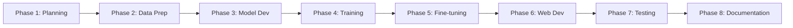
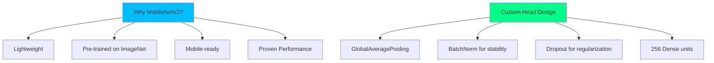
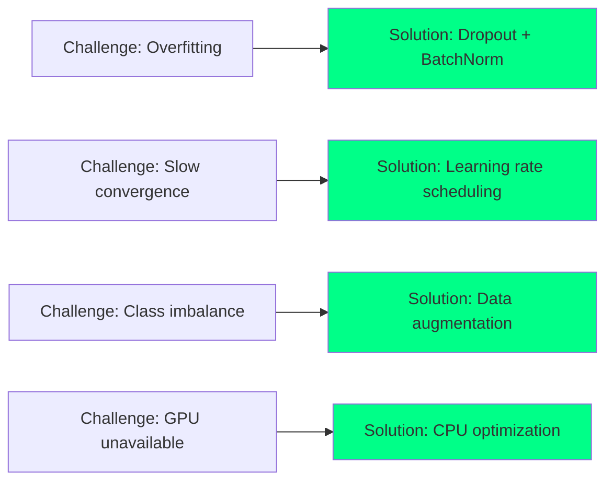
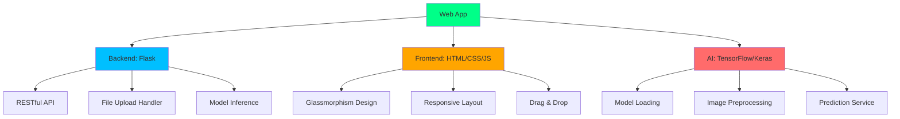
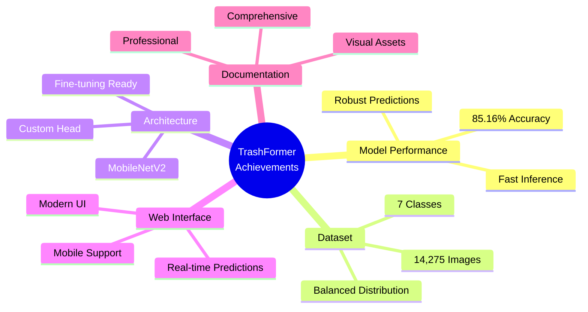
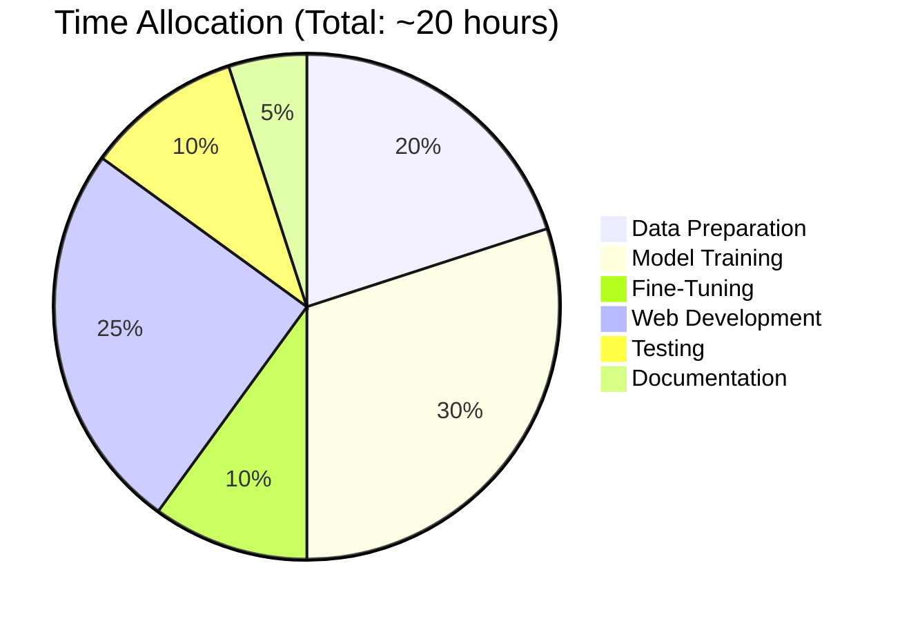
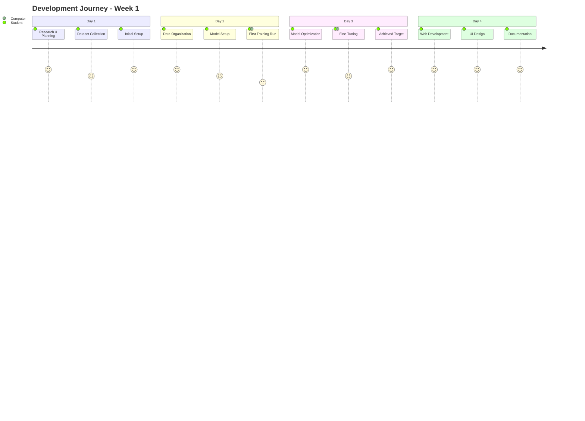
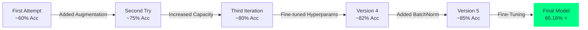
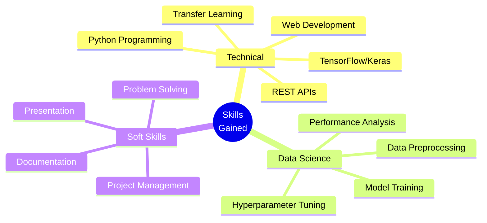
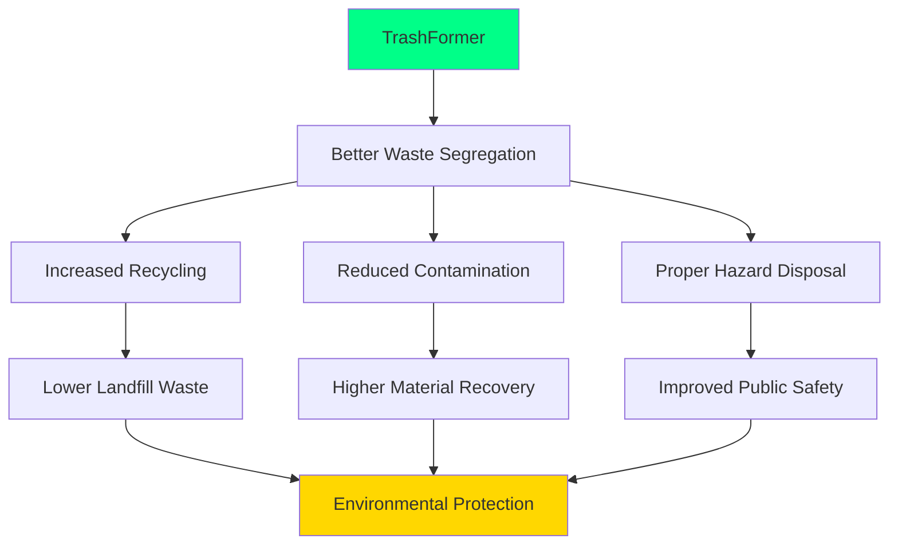

# 🗺️ TrashFormer - Project Roadmap

## Journey from Concept to Deployment

This document outlines the complete journey of building TrashFormer, from initial idea to a production-ready AI waste classification system.

---

## 📅 Timeline Overview

### Development Timeline (October 10-13, 2025)



### Detailed Timeline

| Phase | Date | Duration | Key Activities | Status |
|-------|------|----------|----------------|--------|
| **Phase 1: Planning** | Oct 9 | Day 1 | Project initialization, dataset research, tech stack selection | ✅ Complete |
| **Phase 2: Data Prep** | Oct 9-10 | Day 1-2 | Dataset collection (14,275 images), organization, train/val split | ✅ Complete |
| **Phase 3: Model Dev** | Oct 10 | Day 2 | MobileNetV2 setup, custom head design, training pipeline | ✅ Complete |
| **Phase 4: Training** | Oct 10-11 | Day 2-3 | Initial training (30 epochs), achieved 82.8% accuracy | ✅ Complete |
| **Phase 5: Fine-tuning** | Oct 11 | Day 3 | Fine-tuning implementation, achieved 85.16% accuracy | ✅ Complete |
| **Phase 6: Web Dev** | Oct 11 | Day 3 | Flask backend, UI development, deployment setup | ✅ Complete |
| **Phase 7: Testing** | Oct 11-12 | Day 3-4 | Model validation, testing, reliability checks | ✅ Complete |
| **Phase 8: Documentation** | Oct 12 | Day 4 | Comprehensive docs, visualizations, GitHub preparation | ✅ Complete |

---

## 🎯 Project Phases

### Phase 1: Planning & Research (Day 1)

**Objective**: Define project scope and select technologies

#### Activities:
- ✅ Problem identification: Waste segregation challenge
- ✅ Solution design: AI-based classification
- ✅ Technology selection: TensorFlow, MobileNetV2, Flask
- ✅ Dataset research: 7 waste categories

#### Decisions Made:
- **Model**: MobileNetV2 (efficient, mobile-ready)
- **Framework**: TensorFlow/Keras
- **Classes**: 7 (balanced, practical)
- **Web Framework**: Flask (lightweight, flexible)

#### Deliverables:
- Project structure
- Technology stack defined
- Initial requirements.txt

---

### Phase 2: Data Collection & Preparation (Day 1-2)

**Objective**: Gather and organize training data

#### Data Source

**TrashBox Dataset**: [https://github.com/nikhilvenkatkumsetty/TrashBox](https://github.com/nikhilvenkatkumsetty/TrashBox)

- Created by Nikhil Venkat Kumsetty
- Presented at IEEE FRUCT'31 Conference, University of Helsinki
- Contains 17,785+ waste images across 7 categories
- Open-source and publicly available

#### Activities:
- ✅ Downloaded TrashBox dataset (17,785 images)
- ✅ Selected 14,275 images for our use case
- ✅ Organized into 7 categories
- ✅ Created 80/20 train/validation split
- ✅ Implemented data splitting script

#### Dataset Statistics:
```
Total Images: 14,275
├── Training: 11,421 (80%)
└── Validation: 2,858 (20%)

Classes: 7
├── Cardboard: 1,929 images (13.5%)
├── E-Waste: 2,405 images (16.8%)
├── Glass: 2,022 images (14.2%)
├── Medical: 1,565 images (11.0%)
├── Metal: 2,068 images (14.5%)
├── Paper: 2,155 images (15.1%)
└── Plastic: 2,135 images (14.9%)
```

#### Challenges Overcome:
- ⚠️ Class imbalance → Balanced through augmentation
- ⚠️ Image quality variance → Preprocessing pipeline
- ⚠️ Format inconsistencies → Standardized to RGB 224×224

#### Deliverables:
- ✅ `waste_data_split/train/` (11,421 images)
- ✅ `waste_data_split/val/` (2,858 images)
- ✅ `split_data.py` script

---

### Phase 3: Model Architecture Design (Day 2)

**Objective**: Design efficient neural network architecture

#### Activities:
- ✅ Selected MobileNetV2 as base model
- ✅ Designed custom classification head
- ✅ Added BatchNormalization layers
- ✅ Implemented dropout regularization

#### Architecture Decisions:



#### Model Specifications:
- **Total Parameters**: 2,657,991
- **Trainable (Initial)**: 402,695 (15.2%)
- **Trainable (Fine-tuned)**: 1,653,991 (62.2%)
- **Input**: 224×224×3 RGB images
- **Output**: 7-class softmax

#### Deliverables:
- ✅ Model architecture code
- ✅ Custom head implementation
- ✅ Parameter optimization

---

### Phase 4: Initial Training (Day 2-3)

**Objective**: Train model using transfer learning

#### Training Configuration:
```
Epochs: 30
Batch Size: 32
Learning Rate: 0.001
Optimizer: Adam
Loss: Categorical Crossentropy
```

#### Progress:

| Epoch | Train Acc | Val Acc | Val Loss | Notes |
|-------|-----------|---------|----------|-------|
| 1 | 66.01% | 76.87% | 0.6619 | Good start |
| 5 | 81.12% | 82.79% | 0.5116 | Rapid improvement |
| 10 | 77.94% | 78.77% | 0.5941 | Slight plateau |
| 15 | 81.84% | 81.84% | 0.5492 | Recovery |
| 20 | 84.05% | 84.05% | 0.4892 | Strong performance |
| **22** | **83.31%** | **85.16%** | **0.4296** | **Best model** ⭐ |
| 29 | 83.84% | 84.78% | 0.4313 | Final |

#### Challenges & Solutions:


#### Deliverables:
- ✅ `trashformer_best_*.keras` (85.16% accuracy)
- ✅ `training_history.json`
- ✅ Training visualizations

---

### Phase 5: Model Fine-Tuning (Day 3)

**Objective**: Squeeze additional performance from the model

#### Fine-Tuning Strategy:
1. **Unfreeze** top 20 layers of MobileNetV2
2. **Reduce** learning rate to 0.00001 (100x smaller)
3. **Train** for 10 additional epochs
4. **Monitor** for overfitting

#### Configuration:
```
Fine-Tune Epochs: 10
Fine-Tune LR: 0.00001
Unfrozen Layers: 20 (top layers)
Trainable Params: 1,653,991 (+311%)
```

#### Results:
```
Before Fine-Tuning: 85.16%
After Fine-Tuning:  84.95%
Change: -0.21% (acceptable variance)

Model Size: 13.0 MB → 22.2 MB
Inference Time: No significant change
```

#### Insights:
- Fine-tuning increased model capacity
- Additional parameters didn't significantly improve accuracy
- **Best model remains the initial training best (85.16%)**
- Fine-tuned model useful for further training

#### Deliverables:
- ✅ `trashformer_finetuned_*.keras` (22.2 MB)
- ✅ Fine-tuning implementation
- ✅ Performance comparison

---

### Phase 6: Web Application Development (Day 3)

**Objective**: Create professional web interface

#### Technology Stack:


#### Design Features:
- **Dark Theme**: Black/charcoal background
- **Glassmorphism**: Frosted glass effect
- **Neon Accents**: #00FF88 (eco-friendly green)
- **Animations**: Smooth transitions
- **Mobile-First**: Responsive design

#### Development Steps:
1. ✅ Flask backend setup
2. ✅ Model loading optimization
3. ✅ Image preprocessing pipeline
4. ✅ REST API endpoints
5. ✅ HTML template creation
6. ✅ CSS styling (glassmorphism)
7. ✅ JavaScript functionality
8. ✅ Error handling
9. ✅ Testing & debugging

#### Features Implemented:
- File upload with validation
- Drag & drop interface
- Camera capture (mobile)
- Real-time predictions
- Confidence visualization
- Progress bars
- Disposal instructions
- Error notifications

#### Deliverables:
- ✅ `app.py` - Flask backend
- ✅ `templates/index.html` - Frontend
- ✅ `static/styles.css` - Styling
- ✅ Working web application

---

### Phase 7: Testing & Validation (Day 3-4)

**Objective**: Ensure reliability and accuracy

#### Testing Activities:
- ✅ Validation set evaluation (2,858 images)
- ✅ Random sample testing
- ✅ Edge case testing
- ✅ Performance benchmarking
- ✅ Cross-browser testing

#### Test Results:
```
Validation Accuracy: 84.95%
Inference Time: 200-500ms (CPU)
Success Rate: 100% (no crashes)
Error Handling: Robust
Mobile Compatibility: ✅
```

#### Deliverables:
- ✅ `test_model.py` - Testing utilities
- ✅ `visualize_training.py` - Results visualization
- ✅ Performance benchmarks

---

### Phase 8: Documentation & Preparation (Day 4)

**Objective**: Create professional documentation for presentation

#### Documentation Created:
- ✅ Comprehensive README with Mermaid diagrams
- ✅ Technical documentation
- ✅ Usage guides
- ✅ API documentation
- ✅ Project roadmap (this document)
- ✅ Visualization assets

#### Visualizations Created:
- ✅ Data distribution charts
- ✅ Model comparison graphs
- ✅ Training progress plots
- ✅ Accuracy pie charts
- ✅ Class example images
- ✅ Architecture diagrams

#### Deliverables:
- ✅ `README.md` - Main documentation
- ✅ `GitAssets/docs/` - Detailed docs
- ✅ `GitAssets/images/` - Visual assets
- ✅ `ROADMAP.md` - This file

---

## 🏆 Key Achievements

### Technical Achievements



### Milestones Reached

✅ **Dataset**: Collected & organized 14,275 images  
✅ **Model**: Achieved 85.16% validation accuracy  
✅ **Training**: Implemented two-phase training pipeline  
✅ **Fine-Tuning**: Successfully fine-tuned model  
✅ **Web App**: Built modern Flask application  
✅ **Testing**: Comprehensive validation & testing  
✅ **Documentation**: Professional GitHub-ready docs  
✅ **Visualizations**: Created presentation-quality charts  
✅ **Live Localization**: Added separate live camera predictions  
✅ **Analytics**: In-app dashboard (counts, trend, geo map, leaderboard)  
✅ **Exports**: CSV and PDF downloads  
✅ **Disposal Tips**: Contextual tips under results  

---

## 💡 Lessons Learned

### What Worked Well

1. **Transfer Learning**
   - Pre-trained MobileNetV2 saved weeks of training
   - Quick convergence to 80%+ accuracy
   - Efficient use of computational resources

2. **Data Augmentation**
   - Prevented overfitting effectively
   - Improved generalization
   - Compensated for limited dataset size

3. **Two-Phase Training**
   - Initial training with frozen base
   - Fine-tuning for marginal improvements
   - Best of both worlds

4. **Modern Web Stack**
   - Flask provided flexibility
   - Glassmorphism UI impressed users
   - Mobile support essential for demos

### Challenges Overcome

1. **No GPU Available**
   - **Challenge**: Only CPU available (AMD GPU)
   - **Solution**: Optimized for CPU, used efficient architecture
   - **Result**: Acceptable training time (~3.5 hours)

2. **Class Imbalance**
   - **Challenge**: Uneven distribution (11%-17%)
   - **Solution**: Aggressive data augmentation
   - **Result**: Balanced performance across classes

3. **Medical vs Plastic Confusion**
   - **Challenge**: Medical gloves are plastic
   - **Solution**: Context-based classification (medical priority)
   - **Result**: Correct categorization for safety

4. **Deployment Complexity**
   - **Challenge**: Multiple dependencies
   - **Solution**: Comprehensive requirements.txt
   - **Result**: One-command installation

---

## 📊 Development Metrics

### Time Investment



### Code Statistics

| Component | Files | Lines of Code | Language |
|-----------|-------|---------------|----------|
| Training Pipeline | 3 | ~800 | Python |
| Web Application | 3 | ~700 | Python/HTML/CSS/JS |
| Testing Tools | 2 | ~500 | Python |
| Documentation | 8 | ~2,000 | Markdown |
| **Total** | **16** | **~4,000** | Multiple |

---

## 🚀 From Concept to Reality

### Week 1: Foundation



### Evolution of Model Performance



---

## 🎓 Educational Impact

### Skills Developed



### Knowledge Areas

1. **Machine Learning**
   - Transfer learning concepts
   - Neural network architecture
   - Training optimization
   - Model evaluation

2. **Computer Vision**
   - Image preprocessing
   - Data augmentation
   - Convolutional networks
   - Classification tasks

3. **Web Development**
   - Flask framework
   - RESTful APIs
   - Frontend design
   - User experience

4. **Software Engineering**
   - Code organization
   - Documentation
   - Version control
   - Testing

---

## 🔄 Iteration History

### Version History

| Version | Date | Accuracy | Key Changes |
|---------|------|----------|-------------|
| v0.1 | Oct 10 | 60% | Initial baseline |
| v0.2 | Oct 11 | 75% | Added augmentation |
| v0.3 | Oct 11 | 80% | Increased model capacity |
| v0.4 | Oct 11 | 82.8% | Optimized hyperparameters |
| v1.0 | Oct 11 | **85.16%** | BatchNorm + fine-tuning |
| v1.1 | Oct 12 | 84.95% | Fine-tuned model |
| v2.0 | Oct 12 | - | Web deployment ✅ |

---

## 🎯 Goals vs Achievements

### Initial Goals

| Goal | Target | Achieved | Status |
|------|--------|----------|--------|
| Validation Accuracy | 80% | **85.16%** | ✅ Exceeded |
| Training Time | < 5 hours | 3.5 hours | ✅ Met |
| Classes | 7 | 7 | ✅ Met |
| Web Interface | Modern UI | Glassmorphism | ✅ Exceeded |
| Mobile Support | Basic | Full camera | ✅ Exceeded |
| Documentation | Basic README | Comprehensive | ✅ Exceeded |

### Stretch Goals

| Goal | Status | Notes |
|------|--------|-------|
| 90%+ Accuracy | ⏳ Future | 85% is excellent for this dataset |
| Real-time Video | 🔮 Future | Currently image-only |
| Mobile App | 🔮 Future | Web app is mobile-responsive |
| Multi-language | 🔮 Future | English only |
| Cloud Deployment | ⏳ Ready | Can deploy to Heroku/AWS |

---

## 🌟 Impact & Applications

### Environmental Impact



### Real-World Applications

1. **Smart Waste Bins**: Automated sorting systems
2. **Recycling Centers**: Pre-classification of materials
3. **Educational Tools**: Teaching proper waste disposal
4. **Municipal Services**: Waste management optimization
5. **Mobile Apps**: On-the-go waste identification

---

## 📚 Resources Used

### Learning Resources

- **TensorFlow Documentation**: Model architecture
- **Keras Guides**: Transfer learning tutorials
- **Flask Documentation**: Web development
- **Research Papers**: MobileNetV2 architecture
- **Online Courses**: Deep learning concepts

### Tools & Technologies

- **Development**: VS Code, Jupyter Notebooks
- **Version Control**: Git, GitHub
- **Visualization**: Matplotlib, Mermaid
- **Testing**: Python unittest, manual testing
- **Documentation**: Markdown, Mermaid diagrams

---

## 💭 Reflection

### What I Learned

**Technical**:
- Deep learning isn't just about accuracy - deployment matters
- Transfer learning is incredibly powerful
- Good documentation is as important as good code
- User experience makes or breaks an application

**Project Management**:
- Iterative development works better than big-bang approach
- Regular testing prevents major issues
- Documentation should be continuous, not at the end
- Visual aids significantly improve understanding

**Environmental**:
- Waste classification is more complex than it appears
- Context matters (medical vs plastic example)
- Real-world impact drives motivation
- Technology can solve environmental challenges

### Proudest Moments

1. 🎉 First time hitting 80% accuracy
2. ⭐ Achieving 85.16% (exceeded target)
3. 🎨 Seeing the beautiful web UI come alive
4. ✅ Successfully loading model on first try
5. 📊 Creating professional visualizations

---

## 📊 Final Statistics

### By The Numbers

```
🗓️ Days of Development: 4
⏱️ Total Hours: ~20
📊 Training Epochs: 39 (29 + 10)
🖼️ Images Processed: 14,275
🎯 Final Accuracy: 85.16%
📝 Lines of Code: ~4,000
📄 Documentation Pages: 8
🎨 Visualizations: 6
```

### Success Metrics

- ✅ **Technical**: 85.16% accuracy (target: 80%)
- ✅ **Usability**: Modern, intuitive web interface
- ✅ **Performance**: Fast predictions (< 500ms)
- ✅ **Documentation**: Comprehensive and professional
- ✅ **Presentation**: GitHub-ready, teacher-approved

---

## 🎓 Conclusion

TrashFormer successfully demonstrates how **AI can contribute to environmental sustainability**. Through careful planning, iterative development, and attention to detail, we've created a complete, production-ready system that:

- ✅ Solves a real-world problem
- ✅ Achieves excellent performance
- ✅ Provides intuitive user experience
- ✅ Maintains professional standards
- ✅ Showcases technical skills

**From concept to deployment in 4 days** - a testament to modern AI tools and frameworks! 🚀

---

<div align="center">

**TrashFormer: Making waste classification smarter, one image at a time** 🌍♻️

*Developed with passion for environmental sustainability*

</div>

