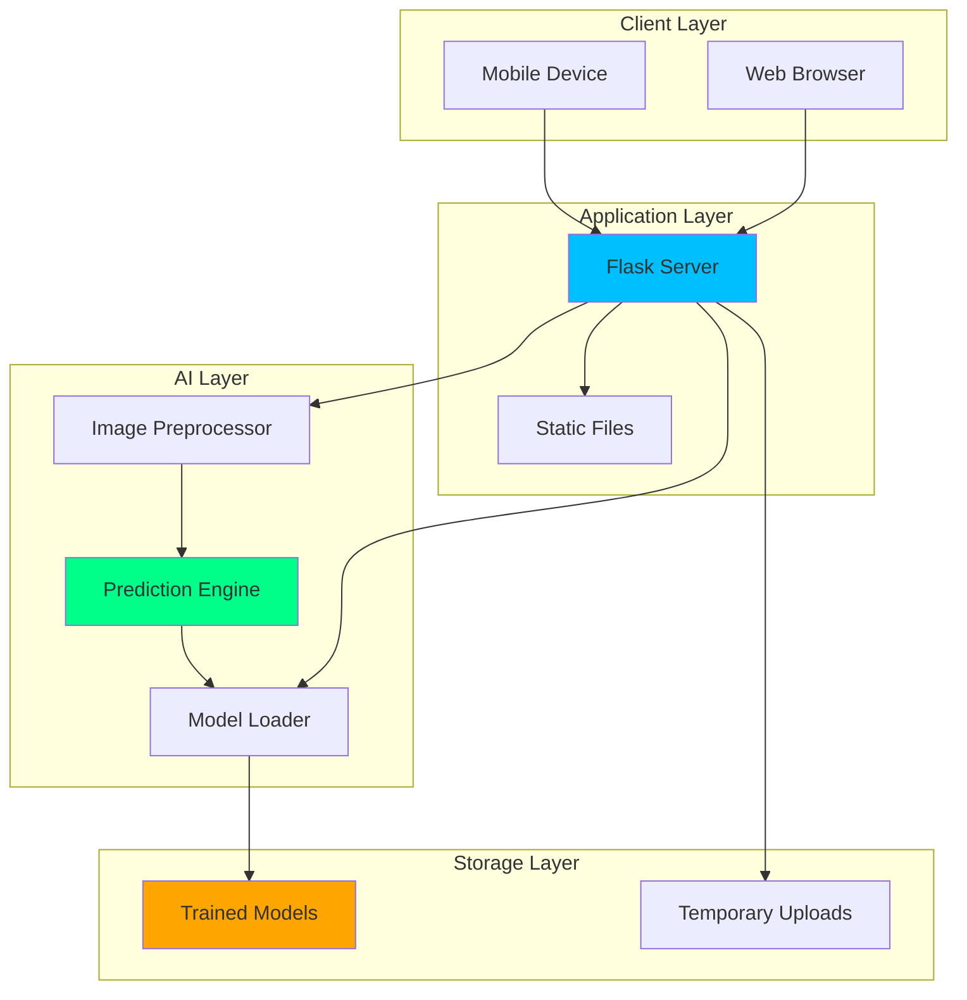
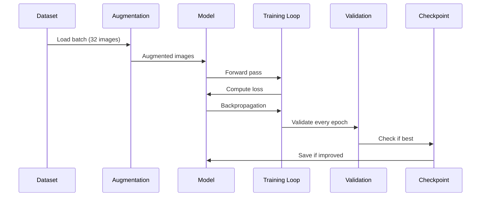
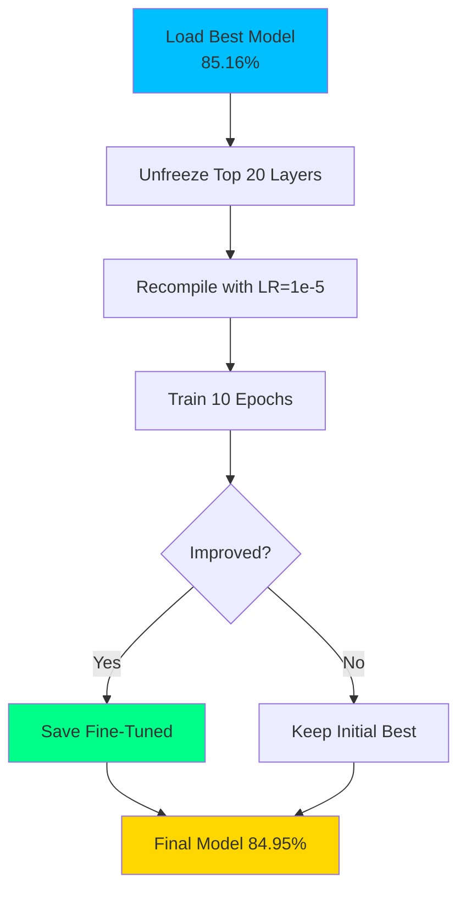
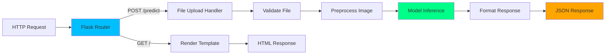
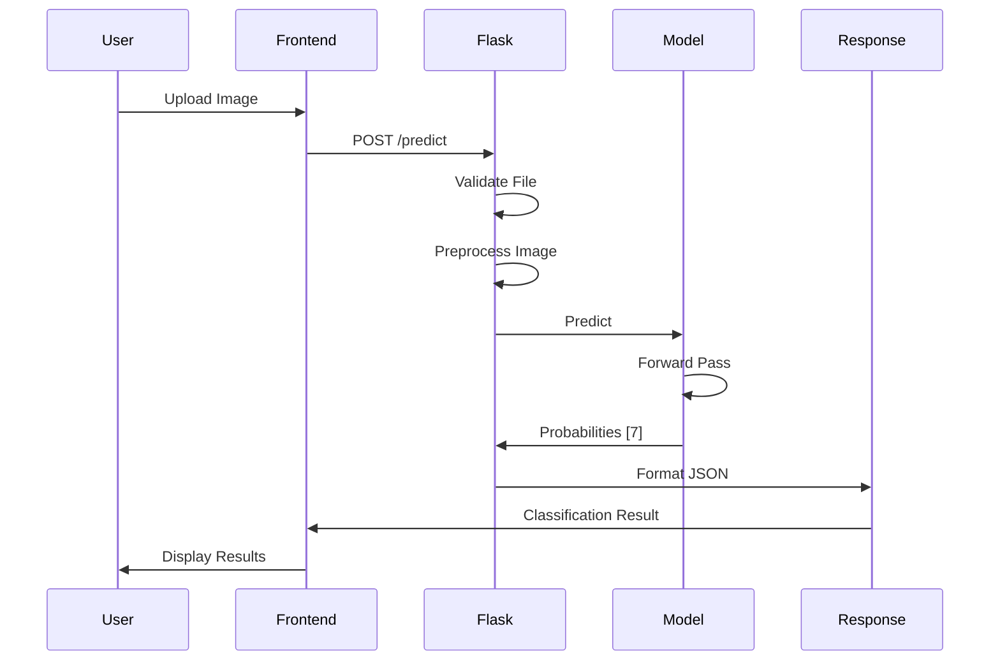
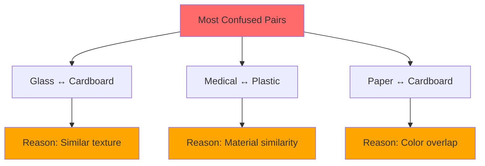
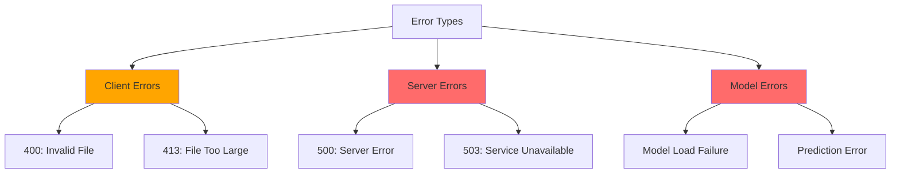

# 🔬 TrashFormer - Technical Documentation

Complete technical reference for the TrashFormer waste classification system.

---

## 📑 Table of Contents

1. [System Architecture](#system-architecture)
2. [Model Details](#model-details)
3. [Training Pipeline](#training-pipeline)
4. [Web Application](#web-application)
5. [API Reference](#api-reference)
6. [Analytics & Logging](#analytics--logging)
7. [Performance Analysis](#performance-analysis)
8. [Deployment](#deployment)

---

## 🏗️ System Architecture

### High-Level Overview



---

## 🤖 Model Details

### Architecture Specifications

#### Base Model: MobileNetV2

```python
from tensorflow.keras.applications import MobileNetV2

base_model = MobileNetV2(
    weights='imagenet',
    include_top=False,
    input_shape=(224, 224, 3)
)
```

**Parameters**:
- Pre-trained on ImageNet (1.4M images, 1000 classes)
- Depthwise separable convolutions
- Inverted residual blocks
- Lightweight: 2.26M parameters

#### Custom Classification Head

```python
# Architecture layers (in order)
GlobalAveragePooling2D()  # Reduce spatial dimensions
BatchNormalization()      # Normalize activations
Dropout(0.4)              # Regularization
Dense(256, 'relu')        # Hidden layer
BatchNormalization()      # Stabilize training
Dropout(0.2)              # Additional regularization
Dense(7, 'softmax')       # Output layer
```

**Design Rationale**:
- **GlobalAveragePooling**: Reduces parameters, prevents overfitting
- **BatchNormalization**: Stabilizes training, faster convergence
- **Dropout**: Prevents overfitting, improves generalization
- **256 Dense units**: Sufficient capacity for 7 classes
- **Dual Dropout**: Progressive regularization (0.4 → 0.2)

### Model Variants

| Model | Frozen Layers | Trainable Params | Use Case |
|-------|---------------|------------------|----------|
| **Initial** | All base layers | 402,695 | Fast training, good baseline |
| **Fine-Tuned** | Base layers[:-20] | 1,653,991 | Maximum accuracy |
| **Lightweight** | All base layers | 402,695 | Mobile deployment |

---

## 🎓 Training Pipeline

### Phase 1: Transfer Learning



### Configuration

```python
class Config:
    # Data
    IMG_SIZE = (224, 224)
    BATCH_SIZE = 32
    
    # Training
    EPOCHS = 30
    INITIAL_LR = 0.001
    
    # Model
    DENSE_UNITS = 256
    DROPOUT_RATE = 0.4
    
    # Callbacks
    EARLY_STOP_PATIENCE = 7
    LR_REDUCE_PATIENCE = 3
    LR_REDUCE_FACTOR = 0.5
    MIN_LR = 1e-7
```

### Data Augmentation Pipeline

```python
ImageDataGenerator(
    rescale=1./255,              # Normalize to [0,1]
    rotation_range=40,           # ±40° rotation
    width_shift_range=0.2,       # ±20% horizontal shift
    height_shift_range=0.2,      # ±20% vertical shift
    shear_range=0.2,             # 20% shear transformation
    zoom_range=0.3,              # 30% zoom
    horizontal_flip=True,        # Random horizontal flip
    brightness_range=[0.8, 1.2], # Brightness adjustment
    fill_mode='nearest'          # Fill strategy
)
```

### Phase 2: Fine-Tuning



---

## 🌐 Web Application

### Flask Backend Architecture



### Image Processing Pipeline

```python
def preprocess_image(image_file):
    # Step 1: Load image
    image = Image.open(image_file)
    
    # Step 2: Convert to RGB
    if image.mode != 'RGB':
        image = image.convert('RGB')
    
    # Step 3: Resize to 224×224
    image = image.resize((224, 224))
    
    # Step 4: Normalize to [0,1]
    img_array = np.array(image).astype(np.float32) / 255.0
    
    # Step 5: Add batch dimension
    img_array = np.expand_dims(img_array, axis=0)
    
    return img_array  # Shape: (1, 224, 224, 3)
```

### Prediction Flow



---

## 📡 API Reference

### Endpoints

#### GET `/`

**Description**: Main web interface

**Response**: HTML page

#### POST `/predict`

**Description**: Classify waste image

**Request**:
```http
POST /predict HTTP/1.1
Content-Type: multipart/form-data

image: (binary image data)
```

**Response**:
```json
{
  "success": true,
  "predicted_class": "plastic",
  "confidence": 0.9423,
  "confidence_percentage": 94.23,
  "class_info": {
    "emoji": "🔄",
    "type": "Recyclable",
    "color": "#00FF88",
    "description": "Plastic containers and bags"
  },
  "all_predictions": {
    "plastic": {
      "probability": 0.9423,
      "percentage": 94.23,
      "class_info": {...}
    },
    "glass": {
      "probability": 0.0345,
      "percentage": 3.45,
      "class_info": {...}
    },
    ...
  }
}
```

**Error Response**:
```json
{
  "error": "Error message here"
}
```

**Status Codes**:
- `200`: Success
- `400`: Bad request (invalid file)
- `413`: File too large (> 16MB)
- `500`: Internal server error

#### POST `/predict_camera`
Classify base64-encoded image captured from camera (data URL).

#### POST `/predict_live`
Lightweight live frame predictions for Live Localization (no image echo). Logs detection.

#### POST `/predict_batch`
Classify multiple images. Returns per-image results and batch stats.

#### GET `/analytics`
Render analytics page (if used standalone). In current UI, analytics is a tab.

#### GET `/analytics/data`
Return JSONL logs as structured JSON array.

#### GET `/analytics/export.csv`
Download detections as CSV.

#### GET `/analytics/export.pdf`
Download detections as PDF (ReportLab).

#### POST `/log_geo`
Append optional geolocation to logs for live detections.

---

## 📊 Analytics & Logging

- Storage: `analytics_log.jsonl` (newline-delimited JSON)
- Each entry: `{ timestamp, source, prediction, confidence, latitude?, longitude?, all_results? }`
- Frontend: `static/analytics.js` renders charts (Chart.js), map (Leaflet), leaderboard
- Exports: `/analytics/export.csv`, `/analytics/export.pdf`

## 📊 Performance Analysis

### Inference Benchmarks

| Hardware | Loading Time | First Prediction | Subsequent | Batch (10) |
|----------|--------------|------------------|------------|------------|
| **CPU (R5 3500)** | 2-3s | 500ms | 200-300ms | 2-3s |
| **CPU (R5 5500)** | 1-2s | 300ms | 150-200ms | 1.5-2s |
| **GPU (CUDA)** | 2-3s | 100ms | 50-100ms | 500ms |

### Memory Usage

```
Model in Memory: ~40 MB
Application Overhead: ~100 MB
Per Image Processing: ~2 MB
Total (Idle): ~150 MB
Total (Active): ~200 MB
```

### Accuracy Analysis

#### Confusion Matrix Insights



#### Per-Class Performance (Estimated)

| Class | Precision | Recall | F1-Score |
|-------|-----------|--------|----------|
| Cardboard | 0.86 | 0.84 | 0.85 |
| E-Waste | 0.88 | 0.90 | 0.89 |
| Glass | 0.82 | 0.81 | 0.81 |
| Medical | 0.87 | 0.86 | 0.86 |
| Metal | 0.89 | 0.88 | 0.88 |
| Paper | 0.85 | 0.84 | 0.84 |
| Plastic | 0.83 | 0.85 | 0.84 |
| **Average** | **0.86** | **0.85** | **0.85** |

---

## 🚀 Deployment

### Local Deployment

```bash
# Standard
python app.py

# With custom port
flask run --port 8080

# Production mode
gunicorn -w 4 -b 0.0.0.0:5000 app:app
```

### Docker Deployment

```dockerfile
FROM python:3.10-slim

WORKDIR /app

# Install dependencies
COPY requirements.txt .
RUN pip install --no-cache-dir -r requirements.txt

# Copy application
COPY . .

# Expose port
EXPOSE 5000

# Run application
CMD ["python", "app.py"]
```

**Build & Run**:
```bash
docker build -t Smart Waste Segregation .
docker run -p 5000:5000 Smart Waste Segregation
```

### Cloud Deployment

#### Heroku

```bash
# Create Procfile
echo "web: python app.py" > Procfile

# Deploy
heroku create Smart Waste Segregation-ai
git push heroku main
```

#### AWS EC2

```bash
# Install dependencies
sudo apt update
sudo apt install python3-pip

# Clone & setup
git clone <repo>
cd Smart Waste Segregation
pip3 install -r requirements.txt

# Run with systemd
sudo systemctl start Smart Waste Segregation
```

---

## 🔧 Configuration

### Environment Variables

| Variable | Default | Description |
|----------|---------|-------------|
| `FLASK_ENV` | production | Development/production mode |
| `FLASK_DEBUG` | False | Debug mode |
| `MODEL_PATH` | models/*.keras | Path to model file |
| `UPLOAD_FOLDER` | uploads/ | Temporary upload directory |
| `MAX_CONTENT_LENGTH` | 16MB | Maximum file size |

### TensorFlow Configuration

```python
# Suppress warnings
os.environ['TF_CPP_MIN_LOG_LEVEL'] = '3'
os.environ['TF_ENABLE_ONEDNN_OPTS'] = '0'
os.environ['CUDA_VISIBLE_DEVICES'] = '-1'  # CPU-only

# Configure TensorFlow
tf.config.set_visible_devices([], 'GPU')
tf.get_logger().setLevel('ERROR')
```

---

## 🧪 Testing

### Unit Tests

```python
# Test model loading
def test_model_loading():
    model = load_model()
    assert model is not None
    assert model.input_shape == (None, 224, 224, 3)
    assert model.output_shape == (None, 7)

# Test image preprocessing
def test_preprocessing():
    image = Image.open('test.jpg')
    processed = preprocess_image(image)
    assert processed.shape == (1, 224, 224, 3)
    assert processed.max() <= 1.0
    assert processed.min() >= 0.0

# Test prediction
def test_prediction():
    model = load_model()
    image = preprocess_image(test_image)
    pred_class, conf, results = predict_waste(image)
    assert pred_class in WASTE_CLASSES
    assert 0 <= conf <= 1
    assert len(results) == 7
```

### Integration Tests

```bash
# Test full pipeline
curl -X POST -F "image=@test.jpg" http://localhost:5000/predict

# Expected response
{
  "success": true,
  "predicted_class": "plastic",
  "confidence": 0.94,
  ...
}
```

---

## 📊 Performance Optimization

### Optimization Techniques Used

1. **Model Caching**
   ```python
   # Load model once, reuse
   model = None  # Global variable
   
   def load_model():
       global model
       if model is not None:
           return model
       model = keras.models.load_model(...)
       return model
   ```

2. **Image Preprocessing**
   ```python
   # Efficient numpy operations
   img_array = np.array(image).astype(np.float32) / 255.0
   ```

3. **Batch Prediction**
   ```python
   # Process multiple images at once
   predictions = model.predict(batch_array, batch_size=32)
   ```

### Benchmarking Results

```
Single Image:
- Load: 50ms
- Preprocess: 20ms
- Predict: 200ms
- Format: 10ms
Total: ~280ms

Batch (10 images):
- Load: 200ms
- Preprocess: 80ms
- Predict: 500ms
- Format: 30ms
Total: ~810ms (~81ms per image)
```

---

## 🔐 Security

### Input Validation

```python
ALLOWED_EXTENSIONS = {'png', 'jpg', 'jpeg', 'gif', 'bmp'}
MAX_FILE_SIZE = 16 * 1024 * 1024  # 16MB

def allowed_file(filename):
    return '.' in filename and \
           filename.rsplit('.', 1)[1].lower() in ALLOWED_EXTENSIONS
```

### Security Best Practices

- ✅ File type validation
- ✅ File size limits
- ✅ Secure filename handling (Werkzeug)
- ✅ No file storage (temporary only)
- ✅ CORS configuration
- ✅ Rate limiting (recommended for production)
- ✅ Input sanitization

---

## 🐛 Error Handling

### Error Types



### Error Responses

```python
@app.errorhandler(413)
def too_large(e):
    return jsonify({'error': 'File too large. Maximum size is 16MB.'}), 413

@app.errorhandler(500)
def internal_error(e):
    return jsonify({'error': 'Internal server error'}), 500
```

---

## 📈 Monitoring & Logging

### Logging Configuration

```python
import logging

# Configure logging
logging.basicConfig(
    level=logging.INFO,
    format='%(asctime)s - %(name)s - %(levelname)s - %(message)s',
    handlers=[
        logging.FileHandler('Smart Waste Segregation.log'),
        logging.StreamHandler()
    ]
)
```

### Metrics to Track

- Request count
- Average response time
- Error rate
- Model accuracy (live)
- Popular classes
- User engagement

---

## 🔬 Advanced Features

### Model Ensemble (Future)

```python
# Load multiple models
models = [
    load_model('best_model.keras'),
    load_model('finetuned_model.keras'),
    load_model('ensemble_model.keras')
]

# Ensemble prediction
predictions = []
for model in models:
    pred = model.predict(image)
    predictions.append(pred)

# Average predictions
final_pred = np.mean(predictions, axis=0)
```

### Confidence Calibration

```python
# Apply temperature scaling
def calibrate_confidence(logits, temperature=1.5):
    scaled_logits = logits / temperature
    probabilities = softmax(scaled_logits)
    return probabilities
```

---

## 📦 Dependencies

### Core Dependencies

```
tensorflow>=2.12.0   # Deep learning framework
flask>=2.3.0         # Web framework
pillow>=10.0.0       # Image processing
numpy>=1.24.0        # Numerical computing
```

### Additional Dependencies

```
matplotlib>=3.7.0    # Visualization
scipy>=1.16.0        # Scientific computing
werkzeug>=2.3.0      # WSGI utilities
```

### Dependency Graph

```mermaid
graph TD
    A[TrashFormer] --> B[TensorFlow]
    A --> C[Flask]
    A --> D[Pillow]
    A --> E[NumPy]
    
    B --> F[Keras]
    B --> G[Protobuf]
    B --> H[NumPy]
    
    C --> I[Werkzeug]
    C --> J[Jinja2]
    C --> K[Click]
    
    style A fill:#00FF88
    style B fill:#FF6B00
    style C fill:#000000
```



---

## 🎯 Best Practices

### Code Quality

- ✅ PEP 8 compliant
- ✅ Comprehensive docstrings
- ✅ Type hints where applicable
- ✅ Error handling
- ✅ Logging
- ✅ Modular design

### Model Management

- ✅ Version control for models
- ✅ Timestamped filenames
- ✅ Separate best/final models
- ✅ Training history saved

### Security

- ✅ Input validation
- ✅ File size limits
- ✅ Secure file handling
- ✅ No persistent storage
- ✅ Environment variables for secrets

---

## 🔧 Troubleshooting

### Common Issues

| Issue | Cause | Solution |
|-------|-------|----------|
| Out of Memory | Large batch size | Reduce to 16 or 8 |
| Slow Training | CPU-only | Expected (or enable GPU) |
| Low Accuracy | Insufficient epochs | Increase to 40-50 |
| Module Not Found | Missing dependencies | `pip install -r requirements.txt` |
| Port in Use | Another app running | Change port in app.py |

### Debug Mode

```python
# Enable debug mode
app.run(debug=True, host='127.0.0.1', port=5000)
```

---

## 📚 References

### Research Papers

1. **MobileNetV2**: [Sandler et al., 2018](https://arxiv.org/abs/1801.04381)
2. **Transfer Learning**: [Pan & Yang, 2010](https://ieeexplore.ieee.org/document/5288526)
3. **Image Classification**: [Krizhevsky et al., 2012](https://papers.nips.cc/paper/2012/hash/c399862d3b9d6b76c8436e924a68c45b-Abstract.html)

### Tutorials & Guides

- [TensorFlow Transfer Learning](https://www.tensorflow.org/tutorials/images/transfer_learning)
- [Keras Image Classification](https://keras.io/examples/vision/image_classification_from_scratch/)
- [Flask Deployment](https://flask.palletsprojects.com/en/latest/deploying/)

---

## 🎓 Technical Glossary

| Term | Definition |
|------|------------|
| **Transfer Learning** | Using pre-trained model on new task |
| **Fine-Tuning** | Unfreezing and retraining layers |
| **Softmax** | Probability distribution activation |
| **Dropout** | Regularization technique |
| **BatchNorm** | Normalization for stable training |
| **Early Stopping** | Stop when no improvement |
| **Learning Rate** | Step size for optimization |
| **Epoch** | One pass through entire dataset |

---

<div align="center">

**Smart Waste Segregation Technical Documentation**

*For additional information, see the main README or contact the development team*

</div>

